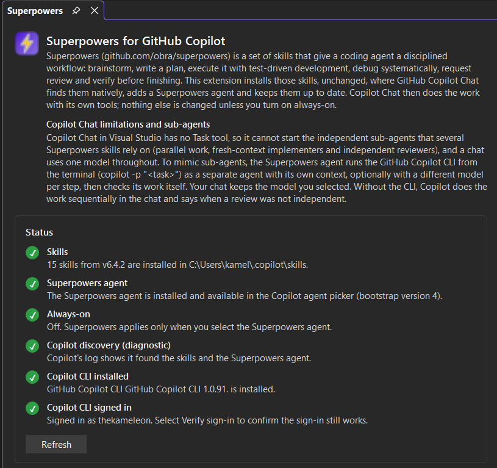
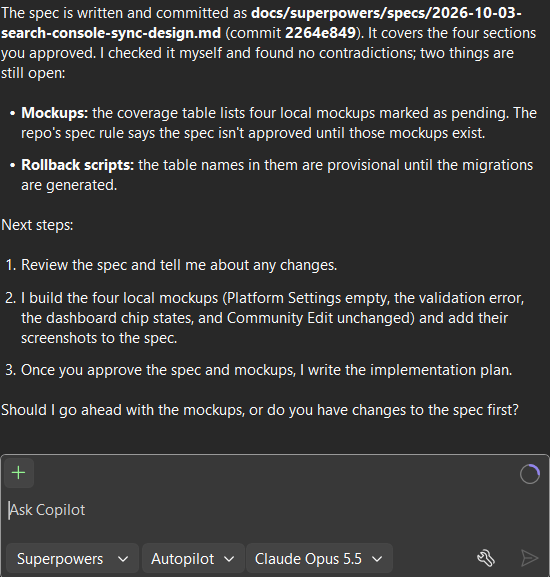
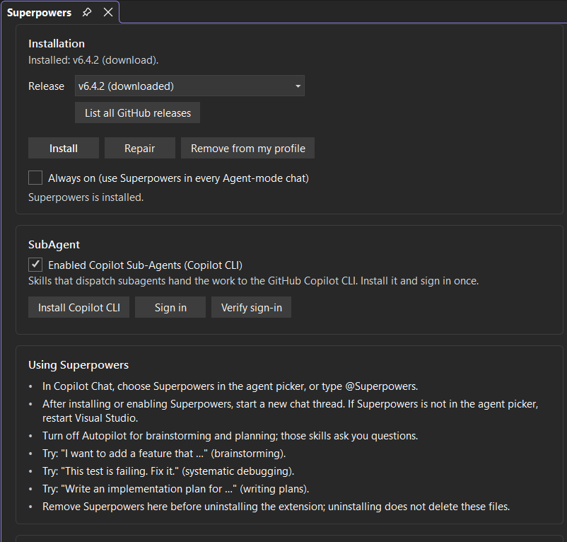
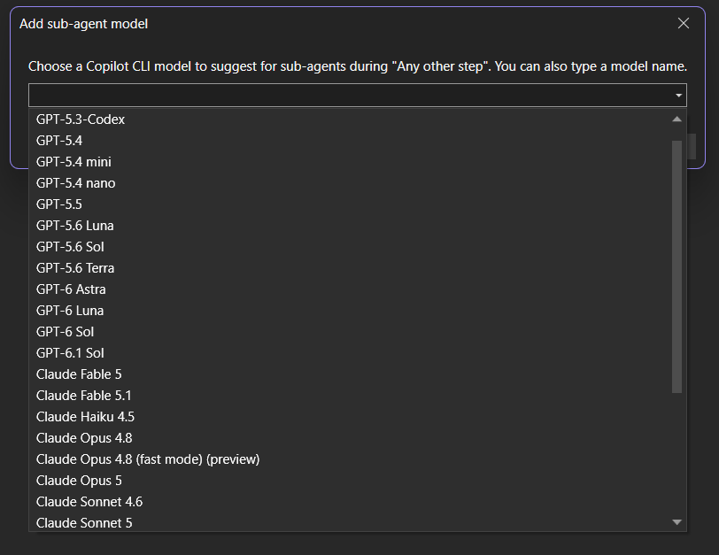

# Superpowers for Visual Studio


Bring structured AI-assisted software engineering directly into Visual Studio.

Superpowers for Visual Studio brings the open-source [Superpowers](https://github.com/obra/superpowers) skills (brainstorming, writing plans, test-driven development, systematic debugging, code review and verification) to GitHub Copilot Chat in **Visual Studio 2026 18.5 or later**. It helps you move beyond one-off prompts toward repeatable, disciplined engineering workflows, whether you are designing a feature, investigating a bug, reviewing code or planning a complex change.

Copilot in Visual Studio natively discovers Agent Skills. This extension installs the unmodified upstream skills where Copilot finds them, and adds a **Superpowers** agent that makes Copilot use them. It is an installer and status panel: Copilot does the work with its own tools, guided by the skills.



## Why Superpowers?

Most AI coding tools excel at generating code. Superpowers focuses on the whole engineering process. Instead of ad hoc prompts and trial and error, the skills guide Copilot to brainstorm and refine requirements first, write a plan, implement it test-first, debug by root cause, request review and verify before calling work done.

## Key features

- **Structured brainstorming:** turn an idea into requirements, a design and an implementation plan before writing code, identifying risks early.
- **Systematic debugging:** root-cause investigation, hypotheses and validation before a fix, instead of guess-and-check.
- **Test-driven development:** test-first, validation-driven implementation workflows.
- **Code review and verification:** request and receive reviews with technical rigor, and require evidence (builds, passing tests) before claiming success.
- **Sub-agents through the Copilot CLI:** independent agents for implementation and review, with per-step model suggestions (see below).
- **Always up to date:** every upstream release at build time ships bundled, and newer releases can be downloaded from GitHub inside Visual Studio.
- **Safe by design:** installs only into locations Copilot already reads, records what it installed, and never overwrites files it did not create.
- **Modern Visual Studio integration:** built on the out-of-process VisualStudio.Extensibility platform.

## Benefits

- Create better implementation plans before code is written.
- Spend less time troubleshooting by finding root causes first.
- Standardize engineering workflows across projects and teams.
- Get more value from GitHub Copilot with proven software engineering practices.

Ideal for developers, technical leads, architects and teams who use AI-assisted development.

## Requirements

- Visual Studio 2026 version 18.5 or later
- GitHub Copilot in Visual Studio (a GitHub Copilot subscription)
- Optional: [GitHub Copilot CLI](https://github.com/github/copilot-cli) for sub-agents (the tool window can install it)

## Install

Install **Superpowers for Visual Studio** from the Visual Studio Marketplace (**Extensions ▸ Manage Extensions**), or build the VSIX from this repository (see [Build and test](#build-and-test)).

## Use it

1. Open **Extensions ▸ Superpowers ▸ Open**.
2. Pick a release (the newest stable one is preselected) and select **Install**.
3. In Copilot Chat, choose **Superpowers** in the agent picker (or type `@Superpowers`) and start a new thread.
4. Turn **Autopilot off** for brainstorming and planning; those skills ask you questions.



Newer Superpowers releases can be checked for and downloaded from GitHub inside the tool window (HTTPS only, pinned to `github.com/obra/superpowers`). Every release available when the VSIX was built ships bundled, so it works offline.

## Copilot Chat limitations and sub-agents

Copilot Chat in Visual Studio has no Task tool, so it cannot start the independent sub-agents that several Superpowers skills rely on (parallel work, fresh-context implementers, independent reviewers), and one chat uses one model throughout.

To mimic sub-agents, the Superpowers agent runs the [GitHub Copilot CLI](https://github.com/github/copilot-cli) from the terminal:

```text
copilot -p "<full task prompt>" --allow-all-tools [--model <name>]
```

Each run is a separate agent with its own context. Copilot Chat then reads the changed files, builds and runs the tests before accepting the work. Without the CLI, Copilot does the work sequentially in the chat and says when a review was not independent. The tool window can install the CLI, sign in and verify it.

### Sub-agent models

Your chat always keeps the model you selected in Copilot Chat. Model choices in the extension apply **only to CLI sub-agents**:

- For each Superpowers step (Plan, Execute, Debug, Tdd, Review, Verify, Refactor, Finish, or **Any other step**), select **Add model...** and choose one or more suggested models.
- Copilot picks among the suggestions for the step it is dispatching, falls back to **Any other step**, and otherwise chooses a model or uses the CLI default. If a model is rejected it tries the next one and tells you which model ran.

<p>
  
  
</p>

## What it changes on your machine

| Location | What |
|---|---|
| `%USERPROFILE%\.copilot\skills\<skill>\` | The upstream skill folders, unchanged |
| `%USERPROFILE%\.github\agents\superpowers.agent.md` | The Superpowers agent |
| `%USERPROFILE%\copilot-instructions.md` | Only if you turn on **always-on**: one marked block; the rest of the file is untouched |
| `%LOCALAPPDATA%\TheKameleon.Superpowers\install-state.json` | What the extension installed, so it never touches anything else |

The extension never overwrites a skill it did not install, and asks before replacing files you edited.

**Before uninstalling the extension, open the tool window and select Remove from my profile.** Visual Studio gives extensions no uninstall hook, so the files stay otherwise.

## Status panel

The tool window checks that the skills and agent are present and unmodified, and warns if the same skills also exist in `~/.claude/skills` or `~/.agents/skills` (Copilot would see duplicates). A diagnostic line reads Copilot's own log to confirm it discovered them; it reports *Unknown* rather than failing when the log cannot confirm.

## Build and test

Requires Windows, Visual Studio 2026 with the extension-development workload, and a `.slnx`-capable .NET SDK (9.0.200 or later). All projects target .NET 8.

```powershell
dotnet build TheKameleon.Superpowers.slnx
dotnet test TheKameleon.Superpowers.Tests/TheKameleon.Superpowers.Tests.csproj
dotnet test TheKameleon.Superpowers.IntegrationTests/TheKameleon.Superpowers.IntegrationTests.csproj
```

Unit tests install into temporary folders and never touch your profile. The F5 experimental instance uses your **real** profile, so Install there changes your real `%USERPROFILE%`.

Manual acceptance on VS 2026: [docs/superpowers/acceptance/agent-skills-acceptance.md](docs/superpowers/acceptance/agent-skills-acceptance.md). Design: [docs/superpowers/specs/2026-09-23-agent-skills-installer-design.md](docs/superpowers/specs/2026-09-23-agent-skills-installer-design.md).

## License

This extension is released under the [MIT License](LICENSE.txt).

Superpowers skills are © Jesse Vincent and contributors, MIT licensed; each bundled release includes its `LICENSE.txt`. The icon is original artwork for this extension. This project is not affiliated with GitHub or Microsoft.
